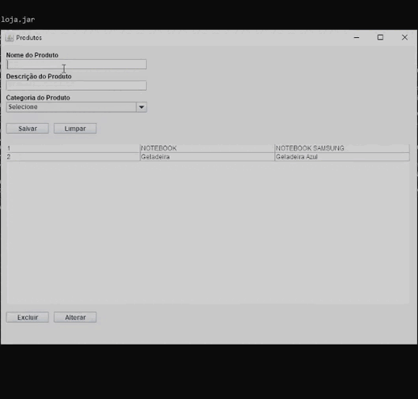

<h1 align="center"> loja-produto </h1>

    

## 🔖 Descrição do Projeto 

 Um projeto de inserção de produtos na interface desktop, ao salvar as informações, elas são diretamente guardadas no Banco de Dados.

        - Inserir Nome do Produto
        - Descrição do Produto
        - Categoria de Produto
        - Salvar no Banco de Dados
        - Limpar a Text área
        - Alterar informações do Banco de Dados
        - Excluir dados

# :hammer: Funcionalidades do projeto

    

# 📁 Acesso ao projeto

Você pode [acessar o código fonte do projeto inicial](https://github.com/Truefenix/loja-produto/tree/master/src/br/com/loja) ou [baixá-lo](https://github.com/Truefenix/loja-produto).

# 🛠️ Abrir e rodar o projeto

Após baixar o projeto, você pode...

- Procure o local onde o projeto está e **copie o diretório da pasta.** (Caso o projeto seja baixado via zip, é necessário extraí-lo antes de procurá-lo).
- **Abra o prompt de comando** (ou alguma opção similar).
- **Cole o diretório da pasta** (cd).
- Coloque os comandos para **executar o desktop**.
          
          java -jar lojar.jar

## ✔️ Técnicas e tecnologias utilizadas

- ``Java 18``
- ``Eclipse IDEA``
- ``MySQL``
- ``JDBC``
- ``Paradigma de orientação a objetos``

##  🐠 Author
<table align="center">
<tr>
<td align="center">
<a href="https://github.com/Truefenix">

 
<b>Eduardo-Roque</b>
</a>
</td>
</tr>
</table>

<h4 align="center">
By<a href="https://github.com/Truefenix" target="_blank"> Eduardo-Roque </a>🐠
</h4>